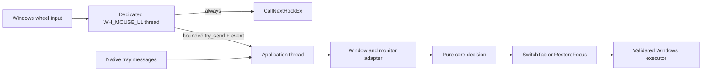

# Architecture

## Boundaries and dependencies

`tabglide-core` is a standard-library-only decision engine. It has no platform imports, system calls, key codes or unsafe code. It accepts opaque `WindowId`/`ApplicationId`, `WindowContext`, `InputEvent`, configuration, mutable `AppState`, and an explicit monotonic `Instant`. Only tests call `Instant::now()` inside the core crate.

`tabglide-config` depends on core, serde, toml and thiserror. It validates configuration and derives `CoreConfig`; callers supply file paths. It does not discover OS directories and forbids unsafe code. Defaults live in Rust and exclusive file creation preserves existing user data, including invalid files.

`tabglide-platform-windows` depends on core/config and owns Win32, all unsafe code, process/window lookup, input injection, shell UI, diagnostics, configuration paths and lifecycle. Its native dependencies (`windows`, tracing and tracing-subscriber) are target-specific. Its private `WindowOperations` seam permits deterministic executor tests; it is not a cross-platform interface. No shared platform trait exists.

The safe Windows application entry point references only the Windows crate under `cfg(windows)`. The two other backend crates have no dependencies and no working backends. Consequently neither macOS nor Linux adds dependencies or code to the Windows application. `cargo tree -p tabglide-windows --target x86_64-pc-windows-msvc` shows the actual graph; Cargo.lock fixes resolved versions. No Tokio, async runtime, web UI, IPC framework or event bus is used.

## Refocus state and executor results

`RefocusState` is Idle or Pending with the first original window, deadline and generation. Every eligible wheel extends that deadline and advances the generation, even if the target is already focused. Unsupported applications/out-of-region events do not extend it. Timers must match both generation and deadline. Disable and successful reload invalidate pending state. Time is passed into the core, never read there.

Commands describe complete operations, not arrays of primitive focus/key actions. A switch validates identity, activates only when needed, confirms the actual foreground window, and sends keys only on success. The caller restores the previous core state if the target is invalid or activation is rejected, retaining any older valid return. An input failure after successful activation retains the return, because focus already moved.

Focus return is process-agnostic: any still-valid original top-level window can be restored, including Windows Explorer. The core and executor therefore have no Explorer-specific return suppression.

## Hook, queue, wakeups and shutdown

One dedicated hook thread installs `WH_MOUSE_LL` with `SetWindowsHookExW` and pumps Windows messages. The callback copies point, signed wheel delta, Windows timestamp and monotonic reception time. It publishes through a 128-element `sync_channel` using `try_send`, signals an auto-reset event and always invokes `CallNextHookEx`. It performs no file/config I/O, UI, sleeps, process queries, logging or thread creation. The bounded channel preallocates storage; payloads are fixed-size. A full channel drops work and increments an atomic diagnostic counter without suppressing the original event.

The sole thread-local callback bridge stores the sender and synchronization handles. It contains no application decision/configuration state; there is no `static mut`. Application state belongs to the application thread. Kernel event handles use narrowly justified Send/Sync implementations and shared ownership, closing only after thread termination.

The application thread drains at most 64 messages and 64 wheel records per iteration, then checks the pending deadline. It uses `MsgWaitForMultipleObjectsEx` on the queue event and native messages, with INFINITE when idle and a timeout calculated from the pending deadline otherwise. This is a one-shot deadline wait, not periodic polling. A pending-item count re-signals after partial drain; an auto-reset event avoids a reset/drain lost wake. No per-event threads or unbounded queues exist.

Shutdown signals a separate stop event, wakes the hook thread, unhooks and joins it, removes the tray icon and destroys its window, then releases the instance mutex. The hook thread reports termination through an event. The `--exit` utility finds the named application window, posts WM_CLOSE and waits on its process handle with a finite deadline; it never force-kills processes by image name. The session-local mutex keeps only one Rust instance alive. AHK instances must be stopped separately.

## Windows adapter and input safety

Context resolution is `WindowFromPoint` → `GetAncestor(GA_ROOT)` → process basename, plus `MonitorFromPoint` / `GetMonitorInfoW` to subtract the actual monitor top. Failed queries skip the event. The embedded manifest uses PerMonitorV2 and asInvoker, so the activation area is expressed in physical monitor pixels even across DPI settings and negative monitor origins.

Windows encodes HWND bits and owning PID/TID in the core's opaque 128-bit identifier. Before acting it calls `IsWindow` and obtains the owner again. Reuse of all three identifiers cannot be fully excluded without lifecycle tracking; no false guarantee is made. Foreign windows are borrowed, never owned or destroyed.

Previous uses Ctrl+Shift+Tab; Next uses Ctrl+Tab. Input sequences are fixed arrays. Held modifiers are checked before processing and immediately before insertion; TabGlide skips modified gestures. Partial `SendInput` insertion triggers best-effort key-up cleanup only for keys pressed by that sequence. A zero result inserts nothing. Failed focus sends no input. Failed input/activation is logged when diagnostics are enabled. Foreground can still race after validation because `SendInput` has no HWND parameter.

UIPI restricts input injection to equal/lower integrity processes. A standard-user process cannot reliably control elevated targets; Windows may not report UIPI specifically as an error. The app never starts elevated to work around it. See [Microsoft SendInput documentation](https://learn.microsoft.com/windows/win32/api/winuser/nf-winuser-sendinput).

`WH_MOUSE_LL` retains direct wheel-event and passthrough semantics with a minimal callback. Raw Input could observe device input without the low-level-hook timeout constraints, but would require separate registration/routing and careful legacy behavior validation. No demonstrated benefit justifies introducing it now. Microsoft recommends moving callback work off the hook thread; see [LowLevelMouseProc](https://learn.microsoft.com/windows/win32/winmsg/lowlevelmouseproc).

## Native shell UI and diagnostics

The tray is isolated from the core in `native/tray.rs`. It uses a hidden top-level Win32 window so Explorer's `TaskbarCreated` broadcast can recreate its icon. The callback translates sent notifications into queued private messages without borrowing mutable application state. Popup menus return command IDs; nested native message loops cannot reenter state mutation. Settings launches native Notepad, and Diagnostics is a native message box. UI opening is not needed for background operation.

Native menus/dialogs temporarily block consumption; the hook still forwards wheel events and bounded storage limits backlog. On returning from UI, captured events are discarded. Startup config errors are shown and cause failure; reload errors preserve the running configuration. Logging is optional, reloadable, and capped by rotating two approximately 2 MiB files. No log/config work occurs in the hook.

## Platform status

- Windows: implemented with Win32; [validation](validation.md) distinguishes automatic evidence from untested desktop scenarios.
- macOS: stub only. Future CGEventTap, Accessibility, native process/window metadata and CGEvent injection; permissions must be designed explicitly.
- Linux X11: `X11Backend` is an uninhabited placeholder. Future XInput2, EWMH and XTest integration.
- Linux Wayland: `WaylandBackend` is an uninhabited placeholder. Global observation, enumeration, focus and injection depend on compositor/portal capabilities; unrestricted equivalents cannot be assumed.

Platform adapters should eventually provide the same semantic inputs/commands without changing the core. A shared backend interface should be extracted only after multiple real implementations justify it.
